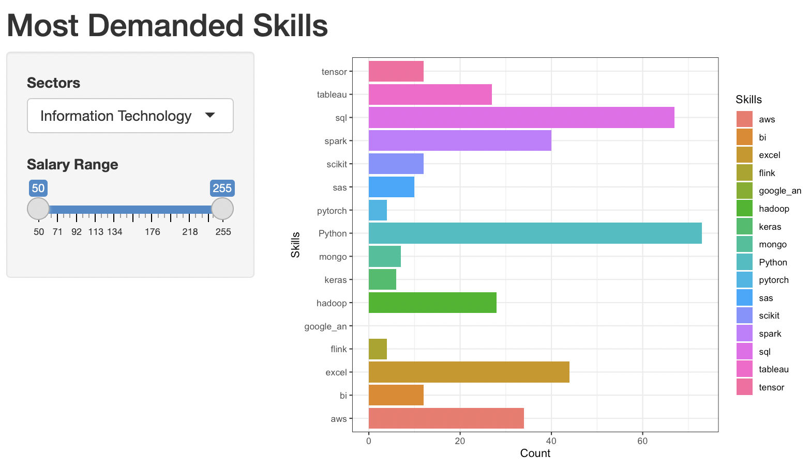

## Question

How would the visualization of different skills required for data scientist roles in companies performing at different Sectors and states look like? 
In addition to that, what are the average salaries for different roles?

## Insights

Information Technology Sector has the most data science roles of **108**.
Following up on that, Biotech & Pharmaceuticals sector has a role of **89**, and Business Service has a role of **70**.

Within IT sector, **California** is the most operated state among companies in IT sector with **41** jobs available. Surprisingly, **New York** only hosts **7** jobs for IT companies. 

These IT companies **want Python the most** from their employees. **SQL and excel** are the **top 2 & 3** most wanted skills from data scientists.

In Biotech & Pharma, **43 roles are in Massachusetts**, and following MA, **California has 15 roles** available for data scientists. 

Here, companies **want excel the most** with **python and AWS as 2nd and 3rd** most sought-after skills.

For business service, jobs are more evenly distributed than other two states: **9 in CA, 8 in PA, 7 in NY & TX**. 

The most wanted skills are as follows: SQL, Python, Excel.

